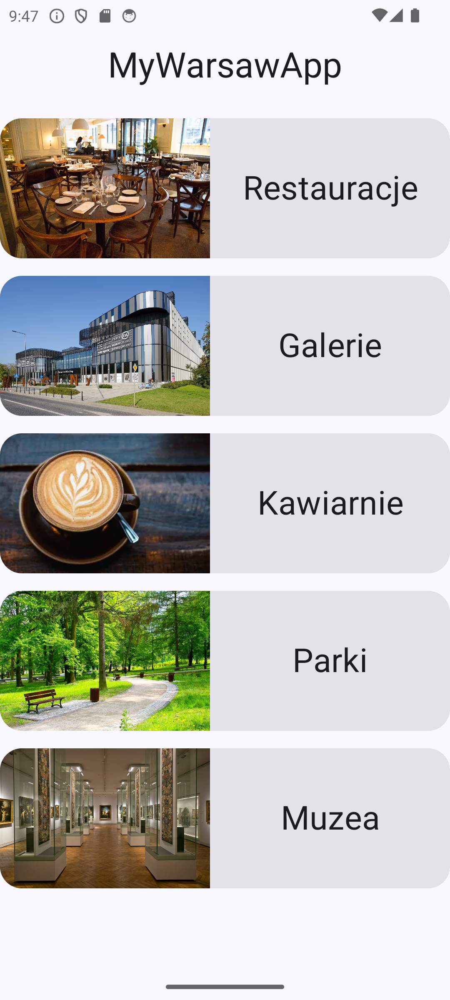
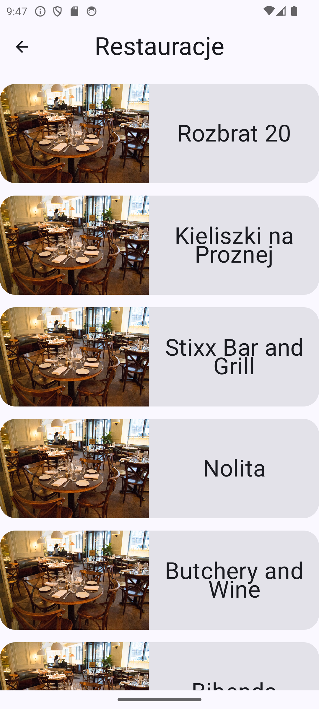
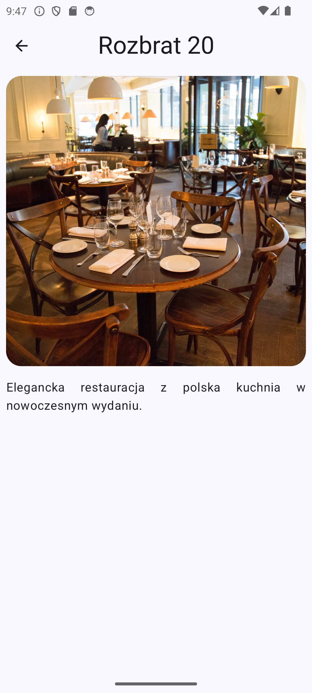
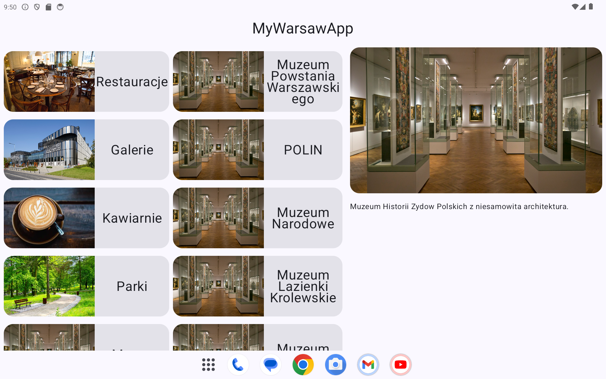

# MyWarsawApp

MyWarsawApp to prosta, ale elegancka aplikacja stworzona w Jetpack Compose, której celem jest zaprezentowanie wybranych miejsc z mojego miasta. Projekt powstał w ramach nauki Androida i pokazuje, jak budować nowoczesne UI, zarządzać stanem oraz tworzyć responsywne ekrany w Compose.

## Screenshoty

### Telefon
| Kategorie | Lista miejsc | Szczegóły miejsca |
|-----------|-------------|-------------------|
|  |  |  |

### Tablet
| Widok tabletu |
|--------------|
|  |

## Funkcje

- Przegladanie kategorii miejsc w Warszawie
- Lista rekomendowanych miejsc w kazdej kategorii
- Szczegolowy opis kazdego miejsca ze zdjeciem
- **Responsywny layout dostosowany do telefonow i tabletow** — na tabletach lista i szczegoly miejsca wyswietlane sa jednoczesnie obok siebie
- Material Design 3

## Kategorie

- Restauracje
- Galerie
- Kawiarnie
- Parki
- Muzea

## Technologie

- Kotlin
- Jetpack Compose
- Material Design 3
- Navigation Compose
- ViewModel & StateFlow
- Adaptive Layout (WindowSizeClass)

## Jak uruchomic

1. Sklonuj repozytorium
2. Otworz projekt w Android Studio
3. Uruchom aplikacje na emulatorze lub fizycznym urzadzeniu

## Autor

Bartek Kakol
